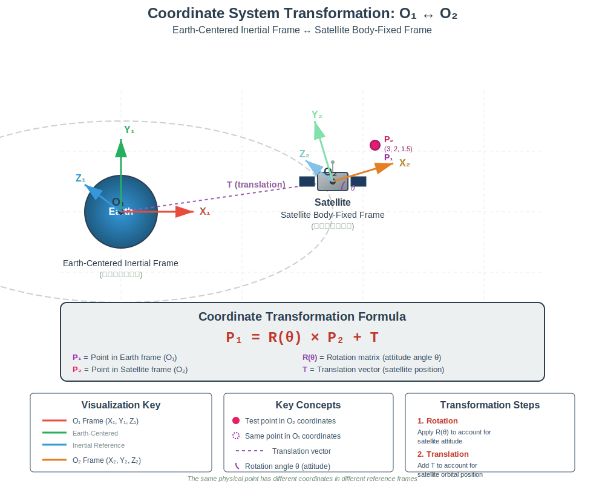

# Chapter 1: Coordinate System Transformation (坐标系变换)

## Overview

This program demonstrates **coordinate transformation between two reference frames** using a satellite orbiting Earth as a practical example. It visualizes how a point's coordinates change when expressed in different reference frames.

## The Two Coordinate Systems

### 1. O₁ Frame - Earth-Centered Inertial Frame (地心惯性坐标系)
- **Origin (O₁)**: Center of the Earth
- **Fixed**: This is the "world" reference frame
- **Axes**: 
  - X₁-axis: Red
  - Y₁-axis: Green  
  - Z₁-axis: Blue
- **Purpose**: Describes positions relative to Earth's center

### 2. O₂ Frame - Satellite Body-Fixed Frame (卫星本体坐标系)
- **Origin (O₂)**: Center of the satellite
- **Moving**: This frame both translates (orbital motion) and rotates (attitude)
- **Axes**:
  - X₂-axis: Orange
  - Y₂-axis: Light Green
  - Z₂-axis: Light Blue
- **Purpose**: Describes positions relative to the satellite's body

## The Transformation Problem

**Question**: If we know a point's coordinates in the satellite frame (O₂), what are its coordinates in the Earth frame (O₁)?

**Real-world example**: A sensor on a satellite detects an object at position (3, 2, 1.5) meters relative to the satellite. Where is this object in Earth-centered coordinates?

## Mathematical Transformation

The transformation from O₂ to O₁ follows the formula:

```
P₁ = R(θ) × P₂ + T
```

Where:
- **P₁** = Point coordinates in O₁ frame (Earth-centered)
- **P₂** = Point coordinates in O₂ frame (Satellite-centered)
- **R(θ)** = Rotation matrix (depends on satellite attitude angle θ)
- **T** = Translation vector (satellite's position in O₁ frame)

### Step-by-Step Transformation

#### Step 1: Rotation
The satellite rotates around its Z-axis (yaw rotation). The rotation matrix for angle θ is:

```
R(θ) = [ cos(θ)  -sin(θ)   0 ]
       [ sin(θ)   cos(θ)   0 ]
       [   0        0      1 ]
```

Apply rotation to P₂:
```
x₁_rot = cos(θ) × x₂ - sin(θ) × y₂
y₁_rot = sin(θ) × x₂ + cos(θ) × y₂
z₁_rot = z₂
```

#### Step 2: Translation
Add the satellite's position in the O₁ frame:
```
x₁ = x₁_rot + Tₓ
y₁ = y₁_rot + Tᵧ
z₁ = z₁_rot + Tᵧ
```

See implementation in `transformToO1Frame()` method (lines 188-208).

## Visual Elements in the Program

### Color Coding

| Element | Color | Meaning |
|---------|-------|---------|
| Earth | Blue-Green | Located at O₁ origin |
| O₁ Axes | Red/Green/Blue | Earth-centered inertial frame |
| Satellite | Gray | Orbiting body with O₂ frame |
| O₂ Axes | Orange/Light Green/Light Blue | Satellite body-fixed frame |
| Test Point (in O₂) | Magenta (solid) | Point expressed in satellite coordinates |
| Test Point (in O₁) | Purple (transparent) | Same point expressed in Earth coordinates |
| Dashed Line | Purple | Shows they are the same physical point |

### Animation

1. **Orbital Motion**: Satellite moves in a circular orbit around Earth
   - Orbital radius: 8.0 km (scaled)
   - Angular velocity: 0.3 rad/s
   
2. **Attitude Rotation**: Satellite rotates around its Z-axis (yaw)
   - Rotation rate: 30°/second
   - This demonstrates how the O₂ frame orientation changes

3. **Point Visualization**: 
   - The **magenta point** moves with the satellite (fixed in O₂ frame)
   - The **purple point** shows the same point in O₁ coordinates
   - The dashed line connects them to show they represent the same physical location

## Key Observations

1. **Same Physical Point, Different Coordinates**: The program shows the same point P with two different coordinate representations:
   - P₂ = (3.0, 2.0, 1.5) in O₂ frame (constant)
   - P₁ = (varies) in O₁ frame (changes as satellite moves and rotates)

2. **Reference Frame Independence**: The physical location doesn't change, only its mathematical representation changes based on the chosen reference frame.

3. **Inverse Transformation**: You could also go from O₁ → O₂:
   ```
   P₂ = R(-θ) × (P₁ - T)
   ```

## Interactive Controls

| Control | Action |
|---------|--------|
| **Mouse Drag** | Rotate camera view |
| **Mouse Wheel** | Zoom in/out |
| **SPACE** | Pause/resume animation |
| **R** | Reset camera and animation |
| **G** | Toggle grid display |
| **T** | Toggle trajectory line |
| **Arrow Keys** | Fine camera rotation |
| **+/-** | Zoom in/out |

## Program Structure

### Main Components

1. **Coordinate Frames** (`drawCoordinateFrame`)
   - Draws X, Y, Z axes with arrows
   - Different colors for O₁ vs O₂

2. **Transformation Logic** (`transformToO1Frame`)
   - Implements P₁ = R × P₂ + T
   - Lines 188-208

3. **Animation Update** (`updateAnimation`)
   - Updates satellite orbital position
   - Updates satellite attitude (yaw rotation)
   - Lines 167-186

4. **Visualization** (`display`)
   - Renders both coordinate frames
   - Shows test point in both representations
   - Draws connecting trajectory
   - Lines 95-165

## Educational Value

This program teaches:

1. **Coordinate Transformations**: How to convert between reference frames
2. **Rotation Matrices**: How orientation affects coordinates
3. **Translation**: How position offset affects coordinates
4. **Composition**: How rotation and translation combine
5. **Reference Frames**: Why the same point has different coordinates in different frames

## Applications

This type of coordinate transformation is fundamental in:

- **Aerospace Engineering**: Satellite navigation, attitude control
- **Robotics**: Robot arm kinematics, mobile robot localization
- **Computer Graphics**: Scene graphs, hierarchical transformations
- **Physics**: Analyzing motion in different reference frames
- **Surveying**: Converting between local and global coordinate systems

## Diagram

See the SVG diagram below for a visual representation of the coordinate transformation:



## Technical Notes

### Parameters
```java
EARTH_RADIUS = 2.5f       // Visual scale
SATELLITE_SIZE = 0.6f     // Visual scale
ORBIT_RADIUS = 8.0f       // Orbital distance
orbitSpeed = 0.3f rad/s   // Orbital angular velocity
rotationSpeed = 30°/s     // Attitude rotation rate
```

### Test Point (Fixed in O₂)
```java
testPointX = 3.0f
testPointY = 2.0f
testPointZ = 1.5f
```

This could represent a sensor, antenna, or other equipment mounted on the satellite at a fixed location relative to the satellite's body.

## Code Highlights

**Transformation Implementation** (lines 188-208):
```java
private float[] transformToO1Frame(float x2, float y2, float z2) {
    double angleRad = Math.toRadians(o2RotationAngle);
    float cosA = (float) Math.cos(angleRad);
    float sinA = (float) Math.sin(angleRad);

    // Step 1: Apply rotation (around Z-axis)
    float x1_rot = cosA * x2 - sinA * y2;
    float y1_rot = sinA * x2 + cosA * y2;
    float z1_rot = z2;

    // Step 2: Apply translation
    float x1 = x1_rot + o2TranslationX;
    float y1 = y1_rot + o2TranslationY;
    float z1 = z1_rot + o2TranslationZ;

    return new float[]{x1, y1, z1};
}
```

## Running the Program

```bash
# Compile and run with Maven
mvn clean compile
mvn exec:java -Dexec.mainClass="org.hkprog.jogl.example.Chapter1"
```

Or run the `main` method in `Chapter1.java` directly from your IDE.

## Further Exploration

Try modifying:
1. **Test point position** (lines 51-53): Change where the point is located in O₂
2. **Rotation axis**: Currently rotates around Z-axis; try X or Y axis
3. **Orbital parameters**: Change orbit radius or speed
4. **Add multiple points**: Show several points transforming simultaneously
5. **3D rotations**: Implement full 3D rotation (roll, pitch, yaw)

---

**Author**: Peter  
**Purpose**: Educational demonstration of coordinate frame transformations  
**Framework**: JOGL (Java OpenGL)

